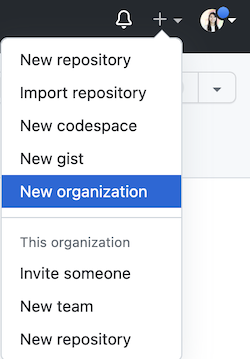

# Creating a GitHub Organization

**Table of Contents:**
- [Set up GitHub Organization](#set-up-github-organization)
- [Create an organization repository](#create-an-organization-repository)

You will be using a GitHub Organization to host your Unit 1 Project. You can follow the instructions below to get started!

## Set up Github Organization
* Sign into Github
* In the top right corner, find the <kbd>+</kbd> icon and select <kbd>New organization</kbd>

* Select <kbd>Create a free organization</kbd>
* Name the organization with an approved team name
* One team-member will enter their email and will make the organization on their personal account.
* Add all teammates to the organization

## Create an organization repository
* From the organization overview page, click on the <kbd>Repositories</kbd> tab.

* Click on <kbd>Create a new repository</kbd>
* Give your repository a name
* Make sure to make the repo **public**
* Add a **README**
* Choose the **MIT License** 
